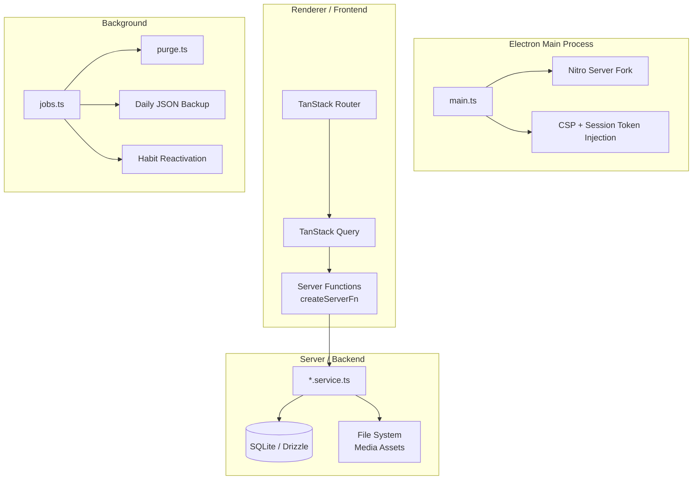
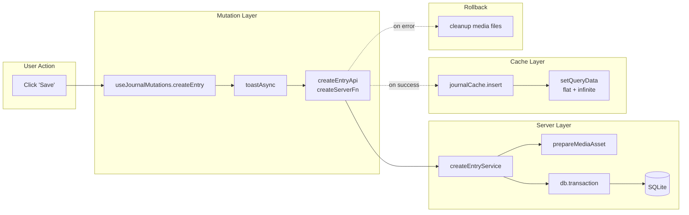

# Sanctuary Codebase Audit

> **Audit Date:** 2026-06-14  
> **Scope:** `apps/desktop` — The Electron + TanStack Start + Nitro desktop application  
> **Methodology:** Manual static analysis of 211 source files (~19,300 LOC)

---

## Executive Summary

Sanctuary is a **local-first, privacy-focused** journaling and habit-tracking Electron app. The architecture is thoughtful and well-layered: a Nitro server handles persistence via SQLite/Drizzle, a React frontend consumes it via TanStack Start server functions, and TanStack Query manages client-side cache with full optimistic update support.

The codebase is **above average for a solo-developer project** and shows genuine architectural discipline. However, several areas need hardening before an open-source release — most notably, the habits route file concentration, unused UI component bloat, and the absence of integration between the `/write` route removal and the dashboard editor flow.

### Overall Score: **7.4 / 10**

| Dimension            | Score    | Summary                                                                        |
| -------------------- | -------- | ------------------------------------------------------------------------------ |
| Architecture         | 8.5 / 10 | Clean feature-sliced design, strong separation of concerns                     |
| Code Quality         | 7.5 / 10 | Strong TypeScript discipline, minimal `any` usage (1 instance)                 |
| Performance          | 6.5 / 10 | Heavy vendor bundles, scene rendering on every page, no lazy routes            |
| DRY Principles       | 7.0 / 10 | Good utilities (`withOptimistic`, `toastAsync`), but habits page is monolithic |
| Feature Completeness | 7.5 / 10 | Core features complete, but dangling state from removed `/write` route         |
| Production Readiness | 6.0 / 10 | Needs OSS polish: CI hardening, contributor DX, dead code removal              |
| Testing              | 7.0 / 10 | Solid service-layer coverage, zero component/hook tests                        |
| Security             | 8.0 / 10 | Session token auth, CSP headers, sandboxed Electron                            |

---

## 1. Architecture

### 1.1 Stack Topology



### 1.2 Feature-Sliced Structure

The project follows a well-defined **feature module** pattern:

```
src/features/{domain}/
  ├── {domain}.api.ts          # Server function declarations
  ├── {domain}.schema.ts       # Zod validation schemas
  ├── {domain}.service.ts      # Business logic (server-side)
  ├── {domain}.cache.ts        # Optimistic cache helpers
  ├── {domain}.mutations.ts    # React hooks wrapping mutations
  ├── {domain}.options.ts      # TanStack Query option factories
  ├── {domain}.keys.ts         # Query key constants
  ├── {domain}.errors.ts       # Domain-specific error classes
  ├── components/              # UI components
  ├── hooks/                   # Domain-specific React hooks
  └── tests/                   # Integration + unit tests
```

> [!TIP]
> This is a **genuinely excellent** pattern. Every feature domain (journal, habits, preferences, prompts, media) follows the same contract. New contributors can learn one module and understand all of them.

### 1.3 Strengths

- **Layered Separation**: API → Schema → Service → Cache → Mutations → Components. Each layer has a single responsibility.
- **Error Hierarchy**: `SanctuaryError` → `DatabaseError`, `JournalError`, `HabitError` etc. Consistent `code` + `status` on every error.
- **Optimistic Updates**: The generic `withOptimistic()` helper + per-domain `cache.ts` files implement snapshot/apply/restore cleanly.
- **Type Safety**: Types are inferred directly from the Drizzle schema (`typeof habits.$inferSelect`), creating a single source of truth.

### 1.4 Weaknesses

- **Route files are too heavy**: `habits.tsx` is 441 LOC — it contains the full creation form, view mode, tier descriptions, evidence log grid, and delete dialog. This should be decomposed.
- **Dashboard (`index.tsx`) duplicates editor state**: The dashboard creates its own `useEntryEditor()` + `useDraft()` independently from the journal route. These are **two completely separate editor instances** with no shared state.
- **Stale `/write` route references**: The `/write` route was deleted but `handleWriteWithPrompt()` in `prompts.tsx` still navigates to `'/'` and the dashboard editor still navigates to `/journal` on save. The flow needs audit.

---

## 2. Code Quality

### 2.1 TypeScript Discipline

| Metric                         | Value             | Assessment                                                                                                  |
| ------------------------------ | ----------------- | ----------------------------------------------------------------------------------------------------------- |
| `any` type usage               | **1** instance    | ✅ Excellent                                                                                                |
| `console.*` in production code | **18** statements | ⚠️ Most are in `jobs.ts`/`purge.ts` — acceptable for server-side logging but should use a structured logger |
| `TODO`/`FIXME`/`HACK` markers  | **0**             | ✅ Clean                                                                                                    |
| Explicit `null` vs `undefined` | Consistent        | Types use `null` for DB fields, `undefined` for optional props                                              |

### 2.2 Error Handling

```
SanctuaryError (abstract)
├── DatabaseError
├── JournalError (with JOURNAL_NOT_FOUND, JOURNAL_CREATE_FAILED, etc.)
├── HabitError
├── MediaError
├── PreferencesError
└── PromptsError
```

- Every service function throws domain-specific errors with codes.
- `parseError()` normalizes unknown errors for toast display.
- `FeatureErrorBoundary` integrates with `useQueryErrorResetBoundary()` for one-click retry.

> [!NOTE]
> The error boundary system is **production-grade**. The combination of `ErrorBoundary` → `FeatureErrorBoundary` → `GlobalErrorFallback` provides three tiers of graceful degradation.

### 2.3 Code Smells

| Smell                                          | Location                                               | Severity    |
| ---------------------------------------------- | ------------------------------------------------------ | ----------- |
| **441-line God component**                     | `routes/__app/habits.tsx`                              | 🔴 High     |
| **Form state as 10 separate `useState` calls** | `habits.tsx` L92–101                                   | 🟡 Medium   |
| **IIFE in JSX**                                | `habits.tsx` L287 `{activeHabit && (() => { ... })()}` | 🟡 Medium   |
| **`useMemo` for side effect**                  | `write.tsx` L41 (now deleted, but pattern existed)     | ✅ Resolved |
| **Unused UI components**                       | 55 components in `components/ui/`, many unused         | 🟡 Medium   |

---

## 3. Performance

### 3.1 Bundle Analysis

The Vite config includes **manual chunk splitting**:

```typescript
codeSplitting: {
  groups: [
    { name: 'vendor-tiptap', test: /@tiptap|prosemirror|marked/ },
    { name: 'vendor-motion', test: /framer-motion/ },
  ],
},
```

> [!WARNING]
> **Missing critical splits.** The following heavy dependencies are NOT split and will be in the main bundle:
>
> - `recharts` (~200KB gzipped) — only used on habits page
> - `radix-ui` (the monolithic `radix-ui` package instead of granular `@radix-ui/*`)
> - `react-day-picker` — only used in settings
> - `embla-carousel-react` — only used for media gallery
> - `cmdk` — only used in settings

### 3.2 Route-Level Code Splitting

**Currently: No lazy routes.** All route components are statically imported via the generated route tree. TanStack Router supports `lazy(() => import(...))` for route components, but this is not utilized.

**Impact**: Every page's component code (including the 441-line habits page, the TipTap editor, recharts, etc.) is loaded on initial page load regardless of which route the user navigates to.

### 3.3 Scene Rendering

The `Background` component renders a **full-screen animated SVG/canvas scene** on every page. Scenes are lazy-loaded (good), but:

- `AnimatePresence mode="sync"` means the old and new scenes render simultaneously during transitions
- Four scene components (Morning, Day, Evening, Night) include animated elements (birds, shooting stars, moon phases) that run continuous animation loops even when the user is focused on content

### 3.4 Query Configuration

```typescript
const queryClient = new QueryClient({
  defaultOptions: {
    queries: {
      staleTime: Infinity,
      refetchOnWindowFocus: false,
      refetchOnReconnect: false,
    },
  },
})
```

> [!TIP]
> This is **correct for a local-first app**. Since the only data source is the local SQLite database (no remote sync), `staleTime: Infinity` prevents unnecessary re-fetches. Cache invalidation is handled explicitly via optimistic updates.

### 3.5 Database Performance

- ✅ WAL mode enabled (`PRAGMA journal_mode=WAL`)
- ✅ `PRAGMA synchronous=NORMAL` for balanced speed/safety
- ✅ Indexes on `deleted_at`, `is_pinned`, `created_at`
- ⚠️ `getAllEntriesService()` fetches up to 100 entries with all media relations — this will slow down as data grows
- ⚠️ `purgeOrphanedMediaFiles()` does a full `SELECT * FROM entry_media` — should be paginated for large datasets

---

## 4. DRY Principles

### 4.1 Good Abstractions

| Utility                             | Purpose                                        | Used By                             |
| ----------------------------------- | ---------------------------------------------- | ----------------------------------- |
| `withOptimistic()`                  | Generic snapshot/apply/restore/execute pattern | Journal, Habits mutations           |
| `toastAsync()`                      | Promise → toast lifecycle binding              | All mutations                       |
| `journalCache`                      | Centralized cache operations                   | Journal mutations                   |
| `FeatureErrorBoundary`              | Query-aware error boundary                     | Every feature section               |
| `EntryListPane` / `EntryViewerPane` | Reusable split-pane layouts                    | Journal, (could be used for Habits) |

### 4.2 DRY Violations

| Violation                         | Description                                                                                                                                                                                                               | Impact             |
| --------------------------------- | ------------------------------------------------------------------------------------------------------------------------------------------------------------------------------------------------------------------------- | ------------------ |
| **Duplicate editor state**        | Dashboard `index.tsx` creates its own `useEntryEditor()` + `useDraft()` completely independent from `journal.tsx`. If the user starts writing on the dashboard and navigates to journal, the draft is on a different key. | 🟡 UX confusion    |
| **Habits cache is ad-hoc**        | Habits mutations call `queryClient.setQueryData` inline instead of through a `habitsCache` object like journal does.                                                                                                      | 🟡 Inconsistency   |
| **Form state not extracted**      | The create-habit form in `habits.tsx` manages 10 `useState` hooks. This could be a `useHabitForm()` hook or a form library integration.                                                                                   | 🟡 Maintainability |
| **Split-pane pattern not reused** | Journal uses `EntryListPane` + `EntryViewerPane`. Habits has `IdentityListPane` + `IdentityViewerPane`. These are structurally identical but implemented separately.                                                      | 🟡 Missed reuse    |

---

## 5. Feature Lifecycle & Completeness

### 5.1 Feature Matrix

| Feature                 | CRUD          | Optimistic     | Validation           | Cache                        | Tests                | Error Handling        | Status                |
| ----------------------- | ------------- | -------------- | -------------------- | ---------------------------- | -------------------- | --------------------- | --------------------- |
| **Journal Entries**     | ✅ Full       | ✅ Yes         | ✅ Zod               | ✅ Dedicated `cache.ts`      | ✅ 3 test files      | ✅ `JournalError`     | 🟢 Complete           |
| **Entry Media**         | ✅ Full       | ⚠️ Partial     | ✅ Base64 validation | ✅ Via journal cache         | ✅ 2 test files      | ✅ `MediaError`       | 🟢 Complete           |
| **Habits**              | ✅ Full       | ⚠️ Inline only | ✅ Zod               | ⚠️ No dedicated `cache.ts`   | ✅ 1 test file       | ✅ `HabitError`       | 🟡 Needs polish       |
| **Prompts**             | ✅ Full       | ⚠️ None        | ✅ Zod               | ⚠️ Via direct `setQueryData` | ✅ 1 test file       | ✅ `PromptsError`     | 🟡 Missing optimistic |
| **Preferences**         | ✅ Full       | ⚠️ None        | ✅ Zod               | ✅ Dedicated                 | ✅ 1 test file       | ✅ `PreferencesError` | 🟢 Complete           |
| **Trash / Soft Delete** | ✅ Full       | ✅ Yes         | ✅                   | ✅                           | ⚠️ Via journal tests | ✅                    | 🟢 Complete           |
| **Export / Backup**     | ✅ Read-only  | N/A            | N/A                  | N/A                          | ✅ 1 test file       | ⚠️ `catch(() => {})`  | 🟡 Silent failures    |
| **Onboarding**          | ✅ One-time   | N/A            | ⚠️ Basic             | N/A                          | ❌ None              | ⚠️ Basic              | 🟡 No tests           |
| **Lock Screen (PIN)**   | ✅ Set/Verify | N/A            | ⚠️ Length only       | N/A                          | ❌ None              | ⚠️ Basic              | 🟡 No tests           |

### 5.2 Dangling State from `/write` Route Removal

The `/write` route was recently deleted but several references remain:

| Location               | Issue                                                                                                                        |
| ---------------------- | ---------------------------------------------------------------------------------------------------------------------------- |
| `prompts.tsx` L53      | `handleWriteWithPrompt()` navigates to `'/'` and sets a pending prompt — this only works if the dashboard editor picks it up |
| `index.tsx` L80        | Dashboard save navigates to `/journal` — **but no inline creation flow exists on dashboard anymore**                         |
| `JournalEditor.tsx`    | `isExpandedPage` prop still exists but nothing sets it to `true`                                                             |
| `useEditorInstance.ts` | `isExpandedPage` branch still in the ternary — dead code                                                                     |

---

## 6. Production Readiness (Open Source Release)

### 6.1 Checklist

| Requirement               | Status                 | Notes                                                                            |
| ------------------------- | ---------------------- | -------------------------------------------------------------------------------- |
| **License**               | ✅ MIT                 | Proper `LICENSE` file present                                                    |
| **README**                | ✅ Present             | 2.6KB — adequate but could be richer                                             |
| **CONTRIBUTING.md**       | ✅ Present             | 6.1KB — comprehensive                                                            |
| **CODE_OF_CONDUCT.md**    | ✅ Present             | Contributor Covenant                                                             |
| **SECURITY.md**           | ✅ Present             | Disclosure process documented                                                    |
| **CHANGELOG.md**          | ⚠️ Minimal             | Only 657 bytes — needs structured versioning                                     |
| **CI/CD Pipeline**        | ⚠️ `.github/` exists   | Needs verification of workflow files                                             |
| **Lint on PR**            | ⚠️ Husky + lint-staged | Works locally, needs CI enforcement                                              |
| **Type checking in CI**   | ❌ Not verified        | `pnpm exec tsc --noEmit` should run in CI                                        |
| **Dead dependency audit** | ❌ Not done            | 55 UI components, many unused                                                    |
| **Env documentation**     | ⚠️ `.env.example`      | Present but minimal (351 bytes)                                                  |
| **Structured logging**    | ❌ Uses `console.*`    | Should use a logger with levels for the server process                           |
| **Error telemetry**       | ❌ None                | Acceptable for privacy-first, but opt-in crash reports would help                |
| **Accessibility**         | ⚠️ Partial             | `aria-label` on nav, `aria-hidden` on background, but forms lack proper labeling |

### 6.2 Dead Code / Unused Dependencies

**55 UI components** are registered in `components/ui/`. Many are standard Shadcn/UI components that were scaffolded but never used:

Likely unused (based on grep analysis):

- `accordion.tsx`, `aspect-ratio.tsx`, `avatar.tsx`, `breadcrumb.tsx`
- `carousel.tsx`, `chart.tsx`, `checkbox.tsx`, `collapsible.tsx`
- `context-menu.tsx`, `direction.tsx`, `drawer.tsx`, `hover-card.tsx`
- `menubar.tsx`, `native-select.tsx`, `navigation-menu.tsx`
- `pagination.tsx`, `radio-group.tsx`, `sidebar.tsx`, `slider.tsx`
- `table.tsx`, `textarea.tsx`, `toggle.tsx`, `toggle-group.tsx`

> [!IMPORTANT]
> These 55 components account for **6,351 LOC** — roughly **33% of the entire codebase**. Removing unused ones would significantly reduce maintenance surface and improve contributor onboarding.

**Recommendation**: Run `knip` or a similar dead-code analyzer and remove all unused components before release.

### 6.3 Dependency Hygiene

| Concern                        | Package                        | Notes                                          |
| ------------------------------ | ------------------------------ | ---------------------------------------------- |
| Beta dependency                | `nitro@3.0.260522-beta`        | Using a beta version in production             |
| Monolithic import              | `radix-ui@1.4.3`               | Should be granular `@radix-ui/react-*` imports |
| Heavy + rarely used            | `recharts@3.8.0`               | ~200KB, only used on habits page               |
| Unused in code?                | `react-resizable-panels`       | Imported but may not be actively used          |
| `@types/mdast` in dependencies | Should be in `devDependencies` |                                                |

---

## 7. Testing

### 7.1 Coverage Map

| Layer                             | Test Files | Type        | Coverage                 |
| --------------------------------- | ---------- | ----------- | ------------------------ |
| `journal.service.test.ts`         | 1          | Unit        | Core CRUD operations     |
| `journal.integration.test.ts`     | 1          | Integration | Full lifecycle with DB   |
| `journal.export.test.ts`          | 1          | Unit        | Export format validation |
| `habits.integration.test.ts`      | 1          | Integration | Create, toggle, delete   |
| `media.service.test.ts`           | 1          | Unit        | Asset preparation        |
| `media.integration.test.ts`       | 1          | Integration | Full upload lifecycle    |
| `preferences.integration.test.ts` | 1          | Integration | CRUD operations          |
| `prompts.integration.test.ts`     | 1          | Integration | CRUD operations          |
| `database.perf.test.ts`           | 1          | Performance | DB operation benchmarks  |
| `purge.test.ts`                   | 1          | Unit        | Stale entry cleanup      |
| `consistency.test.ts`             | 1          | Unit        | Scheduling logic         |
| `use-draft.test.ts`               | 1          | Unit        | Draft hook logic         |
| `scene-registry.test.tsx`         | 1          | Unit        | Scene component loading  |

**Total: 13 test files, ~1,690 LOC**

### 7.2 Testing Gaps

| Gap                                      | Severity  | Notes                                                                                  |
| ---------------------------------------- | --------- | -------------------------------------------------------------------------------------- |
| **Zero component tests**                 | 🔴 High   | No tests for JournalEditor, JournalView, HabitsPage, etc.                              |
| **Zero hook tests** (except `use-draft`) | 🟡 Medium | `useEntryEditor`, `useEntryList`, `useEditorInstance` untested                         |
| **No mutation hook tests**               | 🟡 Medium | `useJournalMutations`, `useHabitsMutations` — complex optimistic logic untested        |
| **No E2E tests**                         | 🟡 Medium | No Playwright/Cypress for full user flows                                              |
| **Cache tests missing**                  | 🟡 Medium | `journalCache` has complex logic (togglePin sort, infinite page updates) with no tests |

---

## 8. Reducing Loading Time

### 8.1 First Load Analysis

The current first-load waterfall looks like:

```
1. Electron boots → forks Nitro server process (~1-2s)
2. Wait for port to become available (~1-3s)
3. Load HTML shell
4. Download + parse JavaScript bundle (ALL routes in one chunk)
5. Execute React, render root → AppShell → load preferences
6. Render animated background scene
7. Fetch journal entries + render dashboard
```

**Estimated cold start: 4-8 seconds** (Electron + server + bundle parse)

### 8.2 Optimization Strategies

#### Priority 1: Route-Level Code Splitting (Impact: 🔴 High)

```typescript
// Current: static imports via routeTree.gen.ts (everything in one bundle)

// Target: lazy route components
export const Route = createFileRoute('/__app/habits')({
  component: () => import('./habits-page').then((m) => m.HabitsPage),
  // or use TanStack Router's built-in lazy support
})
```

**Expected savings**: The habits page alone (441 LOC + recharts + date-fns + selectors) could save ~300KB from the initial bundle.

#### Priority 2: Vendor Chunk Expansion (Impact: 🟡 Medium)

```typescript
// Add to vite.config.ts codeSplitting.groups:
{ name: 'vendor-recharts', test: /recharts|d3/ },
{ name: 'vendor-radix', test: /radix-ui|@radix-ui/ },
{ name: 'vendor-datepicker', test: /react-day-picker|date-fns/ },
```

#### Priority 3: Defer Background Scene (Impact: 🟡 Medium)

The animated background scene is loaded immediately. It could be deferred:

```typescript
// Instead of rendering on mount:
export function Background({ mood }: Props) {
  const [shouldRender, setShouldRender] = useState(false)

  useEffect(() => {
    // Defer scene rendering until after first meaningful paint
    const id = requestIdleCallback(() => setShouldRender(true))
    return () => cancelIdleCallback(id)
  }, [])

  if (!shouldRender) return <div className="fixed inset-0 bg-background" />
  // ... existing scene rendering
}
```

#### Priority 4: Preload Critical Data in Electron Main (Impact: 🟡 Medium)

Currently, the server starts, then the renderer loads, then React hydrates, then queries fire. The server could **pre-warm** the database and cache critical queries before the renderer even connects:

```typescript
// In main.ts, after server is ready:
await waitForPort(PORT)
// Pre-warm: hit the preferences and entries endpoints
fetch(`http://127.0.0.1:${PORT}/api/preferences`)
fetch(`http://127.0.0.1:${PORT}/api/entries`)
// THEN load the window
mainWindow.loadURL(`http://127.0.0.1:${PORT}`)
```

#### Priority 5: Remove Unused UI Components (Impact: 🟢 Low but important)

Removing ~25 unused UI components would:

- Reduce bundle parse time (less code to evaluate)
- Reduce Tailwind CSS output (fewer class references to scan)
- Improve contributor DX (less noise)

#### Priority 6: React Compiler (Already Enabled ✅)

```typescript
babel({ presets: [reactCompilerPreset()] })
```

The React Compiler is already enabled via the Babel plugin. This automatically memoizes components and hooks, reducing unnecessary re-renders.

### 8.3 Estimated Impact

| Optimization               | Bundle Size Reduction | First Paint Improvement |
| -------------------------- | --------------------- | ----------------------- |
| Route-level code splitting | ~30-40% of JS         | ~1-2s                   |
| Vendor chunk expansion     | ~15-20% of initial    | ~0.5-1s                 |
| Deferred background scene  | ~50KB + GPU time      | ~0.3-0.5s               |
| Pre-warmed server data     | 0 (network)           | ~0.5-1s                 |
| Unused component removal   | ~5-10% of CSS+JS      | ~0.2-0.3s               |
| **Combined**               | **~50-60%**           | **~2.5-5s**             |

---

## 9. Security Audit

| Control                     | Status         | Notes                                                                 |
| --------------------------- | -------------- | --------------------------------------------------------------------- |
| **Content Security Policy** | ✅ Implemented | `default-src 'self'`, proper `connect-src` for localhost              |
| **Session Token Auth**      | ✅ Implemented | Random 32-byte hex token, injected via Electron `onBeforeSendHeaders` |
| **Electron Sandbox**        | ✅ Enabled     | `sandbox: true`, `contextIsolation: true`, `nodeIntegration: false`   |
| **Single Instance Lock**    | ✅ Implemented | `app.requestSingleInstanceLock()`                                     |
| **Graceful Shutdown**       | ✅ Implemented | 3-second timeout with force quit fallback                             |
| **Input Validation**        | ✅ Zod schemas | All server functions validate input                                   |
| **SQL Injection**           | ✅ Protected   | Drizzle ORM parameterizes all queries                                 |
| **PIN Storage**             | ⚠️ Plaintext   | `privacyPin` stored as plaintext in SQLite — should be hashed         |
| **`'unsafe-inline'`**       | ⚠️ In CSP      | Both `script-src` and `style-src` allow `unsafe-inline`               |

---

## 10. Prioritized Action Plan

### 🔴 P0 — Before Open Source Release

1. **Remove unused UI components** — Run `knip`, delete ~25 unused components (saves 3,000+ LOC)
2. **Hash the privacy PIN** — Use bcrypt/argon2 before storing in DB
3. **Add route-level code splitting** — Lazy-load habits, prompts, journal, trash routes
4. **Decompose `habits.tsx`** — Extract `HabitCreateForm`, `HabitDetailView`, `HabitEvidenceLog` components
5. **Clean up `/write` route residue** — Remove `isExpandedPage` branches, audit `handleWriteWithPrompt`
6. **Add `CHANGELOG.md` structure** — Use Keep a Changelog format with semver

### 🟡 P1 — Quality Hardening

7. **Create `habitsCache.ts`** — Mirror journal's cache pattern for consistency
8. **Extract `useHabitForm()` hook** — Replace 10 `useState` calls with a form reducer/hook
9. **Add component tests** — At minimum: `JournalEditor`, `JournalView`, `HabitsPage`
10. **Add cache unit tests** — `journalCache.togglePin`, `journalCache.insert` (infinite page handling)
11. **Unify editor state** — Dashboard and journal should share a single draft key strategy
12. **Replace `console.*`** — Introduce a structured logger for the server process

### 🟢 P2 — Performance & Polish

13. **Expand vendor chunk splitting** — Add recharts, radix, date-fns splits
14. **Defer background scene** — Use `requestIdleCallback` to delay scene rendering
15. **Pre-warm server data** — Hit critical endpoints before loading the renderer
16. **Audit `radix-ui` monolith** — Consider switching to granular `@radix-ui/react-*` packages
17. **Add E2E tests** — Playwright for critical user flows (create entry, complete habit, PIN lock)
18. **Move `@types/mdast` to devDependencies**

---

## Appendix A: File Distribution

| Directory                                           | Files    | LOC         | % of Total |
| --------------------------------------------------- | -------- | ----------- | ---------- |
| `src/features/`                                     | ~55      | 4,895       | 25.4%      |
| `src/components/ui/`                                | 55       | 6,351       | 32.9%      |
| `src/components/layout/`                            | ~20      | ~2,200      | 11.4%      |
| `src/routes/`                                       | 7        | 1,249       | 6.5%       |
| `src/test/` + `**/tests/`                           | 13       | 1,690       | 8.8%       |
| `src/lib/` + `src/utils/` + `src/hooks/`            | ~20      | ~1,500      | 7.8%       |
| Other (`database/`, `config/`, `stores/`, `types/`) | ~15      | ~1,400      | 7.3%       |
| **Total**                                           | **~211** | **~19,300** | **100%**   |

## Appendix B: Dependency Graph (Key Flows)


